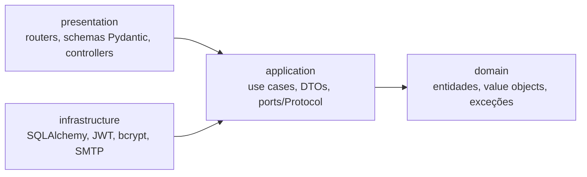
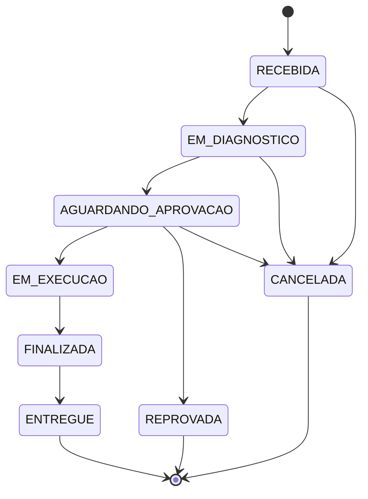

# Arquitetura

## Camadas

O projeto segue Clean Architecture, com regra de dependência única: nada em `domain`
importa de fora dele, `application` só conhece `domain` e `Protocol`s que ela mesma
declara, e `infrastructure`/`presentation` são quem depende de tudo — nunca o
contrário.

| Camada | Caminho | Responsabilidade |
|---|---|---|
| `domain` | `app/domain/` | Entidades, Value Objects, exceções de negócio. Zero import de FastAPI/SQLAlchemy/Pydantic. |
| `application` | `app/application/` | Casos de uso (orquestram o domínio) e os `Protocol`s (ports) que a infraestrutura implementa. |
| `infrastructure` | `app/infrastructure/` | Adapters concretos: repositórios SQLAlchemy, hash de senha (`bcrypt`), JWT, envio de e-mail. |
| `presentation` | `app/presentation/` | Routers FastAPI, schemas de entrada/saída, mapeamento de exceção de domínio → status HTTP. |

A composição (qual implementação concreta cai em qual `Protocol`) acontece nos
`dependencies.py` de cada módulo em `presentation/api/v1/`, via `Depends()` do FastAPI —
é o único lugar do código que "sabe" a implementação real por trás de uma porta.

## Domain-Driven Design

### Entidades (têm identidade e ciclo de vida)

`Cliente`, `Veiculo`, `Servico`, `Peca`, `Usuario` e `OrdemServico` — cada uma com `id`
próprio, igualdade por identidade.

### Value Objects (imutáveis, igualdade por valor, sempre válidos ao construir)

| Value Object | Local | Garante |
|---|---|---|
| `Documento` | `app/domain/cliente/value_objects/documento.py` | CPF/CNPJ com dígito verificador válido |
| `Placa` | `app/domain/veiculo/value_objects/placa.py` | Formato de placa válido |
| `Money` | `app/domain/shared/value_objects/money.py` | Valor monetário em `Decimal`, sempre arredondado a 2 casas, nunca negativo |
| `Orcamento` | `app/domain/ordem_servico/value_objects/orcamento.py` | Soma de serviços + peças de uma OS |

### Aggregate

`OrdemServico` é o aggregate root da OS: `ItemServico`/`ItemPeca` só existem dentro dela,
nunca são acessados nem persistidos separadamente. A máquina de estados que rege a
transição entre status vive dentro da própria entidade (`_TRANSICOES_VALIDAS`), não é
checada "por fora" na camada de aplicação:

### Linguagem ubíqua

Glossário completo dos termos de negócio e onde cada um vive no código:
[docs/linguagem-ubiqua.md](linguagem-ubiqua.md).

## Portas e adapters

Toda dependência de infraestrutura é declarada como `Protocol` em `application/*/ports/`
e implementada em `infrastructure/`. Exemplo — notificação de orçamento:

- Porta: `NotificadorOrcamentoProtocol` (`app/application/ordem_servico/ports/`)
- Adapters: `LogNotificadorOrcamento` (padrão, sem dependência externa) e
  `SmtpNotificadorOrcamento` (envio real por e-mail) — escolhidos em runtime pela
  variável `NOTIFICACAO_BACKEND`.

O mesmo padrão se repete para persistência (`*RepositoryProtocol` → repositório
SQLAlchemy), hash de senha (`PasswordHasherProtocol` → `BcryptPasswordHasher`) e emissão
de token (`TokenProviderProtocol` → `JWTTokenProvider`) — nenhum caso de uso importa uma
biblioteca concreta, só o `Protocol`.
